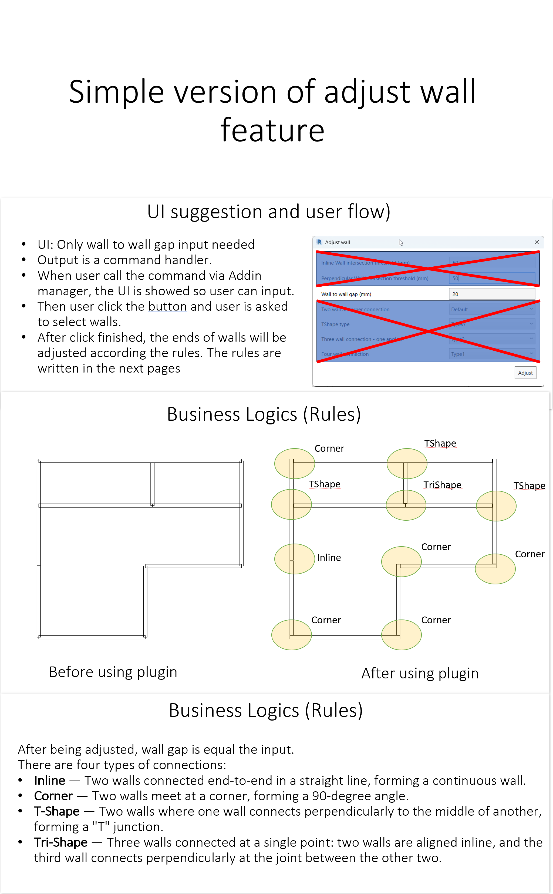

# RevitAdjustWall - Wall Connection Adjustment Tool

## Overview

The **AdjustWallCommand** is a Revit add-in that provides intelligent wall gap adjustment functionality for different types of wall connections. The tool automatically detects connection types and applies appropriate gap adjustments while maintaining proper wall relationships and geometric constraints.

## Features

- **Automatic Connection Detection**: Intelligently identifies connection types based on wall geometry
- **Multiple Connection Types**: Supports Corner, T-Shape, Tri-Shape, and Inline connections
- **Precise Gap Control**: Configurable gap distance with validation (1-1000mm)
- **Smart Wall Adjustment**: Maintains wall thickness relationships and geometric integrity
- **User-Friendly Interface**: WPF-based dialog with real-time validation

## Supported Connection Types

### 1. Corner Connections (L-Shape)
**Description**: Two perpendicular walls meeting at their endpoints, forming a 90-degree angle.

**Characteristics**:
- Exactly 2 walls
- Walls are perpendicular (90° ± tolerance)
- Connection point is at or near wall endpoints
- Both walls are adjusted to maintain gap

**Adjustment Logic**:
- Wall 1: Pushed back by `-(wall2.halfThickness + gapDistance)`
- Wall 2: Pushed back by `wall1.halfThickness`
- Creates precise corner gap while maintaining perpendicular relationship

### 2. T-Shape Connections
**Description**: One wall connects perpendicularly to the middle or end of another wall, forming a "T" junction.

**Characteristics**:
- Exactly 2 walls
- Walls are perpendicular
- Connection point lies on one wall's centerline
- Only the connecting (cross) wall is adjusted

**Adjustment Logic**:
- Main wall: Remains unchanged
- Cross wall: Pushed back by `mainWall.halfThickness + gapDistance`
- Maintains T-junction while creating specified gap

### 3. Tri-Shape Connections
**Description**: Three walls meeting at a single point where two walls are inline and one wall is perpendicular.

**Characteristics**:
- Exactly 3 walls
- Two walls are parallel/inline
- One wall is perpendicular to the inline walls
- All three walls are adjusted

**Adjustment Logic**:
- Inline walls: Each moves `gapDistance/2` away from connection center
- Cross wall: Adjusted to maintain gap from inline walls
- Creates centered gap between all three walls

### 4. Inline Connections
**Description**: Two walls connected end-to-end in a straight line, forming a continuous wall.

**Characteristics**:
- Exactly 2 walls
- Walls are collinear (parallel and aligned)
- Connection point is between wall endpoints
- One wall is adjusted to create gap

**Adjustment Logic**:
- Reference wall: Remains unchanged
- Adjusting wall: Moved by `gapDistance` away from connection point
- Creates linear gap between collinear walls

## Usage Guide

### Step 1: Launch the Command
1. Open Revit with the RevitAdjustWall add-in loaded
2. Execute the `AdjustWallCommand` from the Revit ribbon or command line
3. The Wall Adjustment dialog will appear

### Step 2: Set Gap Distance
1. Enter the desired gap distance in millimeters (1-1000mm range)
2. The input supports both comma and dot as decimal separators
3. Real-time validation provides immediate feedback

### Step 3: Select Walls
1. Click "Pick Walls" button in the dialog
2. Select 2-3 walls that form a connection in the Revit model
3. Only straight walls (Line-based) are supported
4. The tool will automatically detect the connection type

### Step 4: Apply Adjustment
1. The tool validates the selected walls and connection type
2. If valid, walls are automatically adjusted with the specified gap
3. Changes are applied within a Revit transaction for undo capability

## Parameters

### Gap Distance
- **Type**: Double (millimeters)
- **Range**: 1.0 - 1000.0 mm
- **Default**: 20 mm
- **Validation**: Real-time input validation with error messages
- **Internal Conversion**: Automatically converted to Revit internal units (feet)

### Wall Selection
- **Count**: 2-3 walls depending on connection type
- **Type**: Only straight walls (LocationCurve with Line geometry)
- **Filter**: Automatic filtering ensures only valid wall elements can be selected

## Implementation Details

### Architecture
The tool follows SOLID principles with a clean architecture:

- **Command Pattern**: `AdjustWallCommand` implements `IExternalCommand`
- **Strategy Pattern**: Connection handlers implement `IConnectionHandler`
- **Factory Pattern**: `ConnectionFactory` manages handler selection
- **MVVM Pattern**: WPF UI uses ViewModel pattern for data binding

### Connection Handler Priority
Handlers are evaluated in priority order:
1. `CornerConnectionHandler`
2. `TShapeConnectionHandler` 
3. `TriShapeConnectionHandler`
4. `InlineConnectionHandler`

### Key Classes
- **AdjustWallCommand**: Main entry point and Revit command implementation
- **WallConnection**: Represents a wall connection with type and geometry
- **WallInfo**: Wrapper for Revit Wall with geometric properties
- **ConnectionFactory**: Creates appropriate handlers for wall configurations
- **InputValidator**: Validates gap distance input with proper error handling

## Error Handling

### Common Validation Errors
- **Invalid wall count**: "Select between 2 and 3 walls"
- **Non-straight walls**: "Only straight walls are supported"
- **Invalid connection**: "Invalid wall connection. Cannot proceed with adjustment"
- **Invalid gap distance**: Range and format validation with specific error messages

### Transaction Safety
- All wall modifications are wrapped in Revit transactions
- Failed operations can be undone using Revit's standard undo functionality
- Robust error handling prevents model corruption

## Requirements

- **Revit Version**: 2024+ (supports both .NET Framework 4.8 and .NET 8)
- **Wall Types**: Only straight walls with Line-based LocationCurve
- **Units**: Input in millimeters, internal calculations in Revit units (feet)

## License

Copyright © 2025 GiangVu. All rights reserved.
